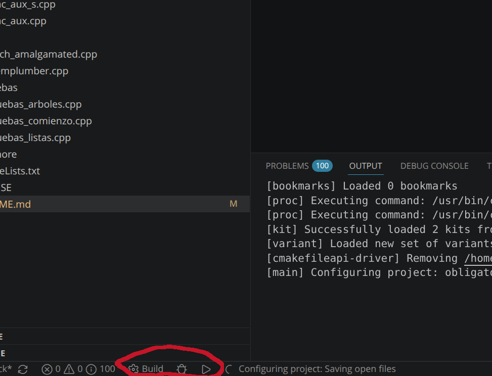

# Instrucciones para usar VSCode en Windows
 
### Git Windows

No es estrictamente necesario, pero permitirá obtener fácilmente las actualizaciones del obligatorio.

Abrir la terminal y ejecutar:

```sh
winget install --id Git.Git -e --source winget
```

### Build Tools

Herramientas de compilación de C/C++. Ir a
[Visual Studio Downloads for Windows](https://visualstudio.microsoft.com/downloads/#remote-tools-for-visual-studio-2026), seleccionar instalar `Herramientas de C++`.
 
### VScode 

Descargar e instalar [Visual Studio Code](https://code.visualstudio.com/).
 
### Repositorio

Para obtener el código del obligatorio, abrir terminal en alguna carpeta a elección, y ejecutar:

```sh
git clone https://github.com/Algoritmos1-ORT/obligatorio1_v2.git
```

Para abrirlo en VSCode navegar al directorio y abrir el VSCode:

```sh
cd .\obligatorio1_v2\
code .
```

### Compilación

Cuando se abre el proyecto, hay que marcar la carpeta como "Trusted" (Confiable?). Luego, ir a las extensiones,
buscar e instalar `C/C++ Extension Pack`.

Una vez instalados, abrir la paleta de comandos (`Ctrl + Shift + P`) y escribir `CMake scan for kit`. Esto
busca todos los compiladores de C/C++ que tengan instalados.

Abrir la paleta de comandos de nuevo (`Ctrl + Shift + P`) y escribir `CMake select a kit`. De la lista se puede
elegir `Unspecified` o `Visual Studio Tools`.

Una vez elegido, abajo a la izquierda aparece el botón de compilar (build), el de debuggear, y el play de ejecutar:



### Errores posibles

> Error al ejecutar el programa 'obligatorio1.exe': Una directiva de Control de aplicaciones 
> bloqueó este archivo

Solucion: Ir a `Seguridad de Windows - Control de aplicaciones u navegador - Configuracion de Control Inteligente de Aplicaciones`
Marcar `Desactivado`.